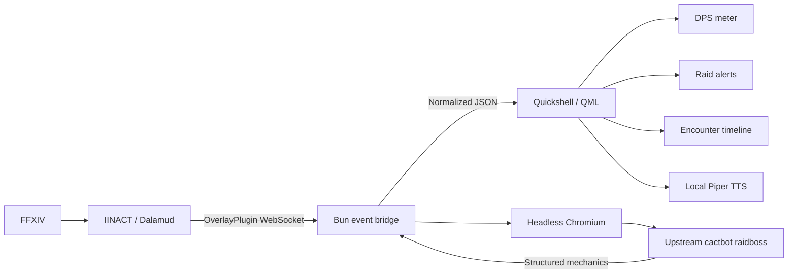
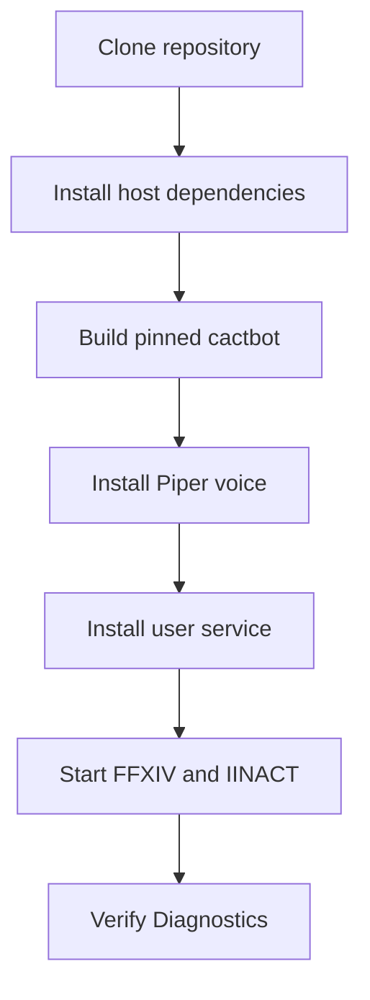

# faiyt-qs-ffxiv-overlay

A standalone, Wayland-native FFXIV overlay built with
[Quickshell](https://quickshell.org/). IINACT supplies live game and combat
events, upstream cactbot supplies raidboss encounter logic, and QML renders the
visible interface without a browser overlay window.

This is an independent application. It does not run inside or require
`faiyt-qs`; it only shares its Rosé Pine visual direction.

> [!IMPORTANT]
> This is an unofficial Linux/Hyprland project. It is not affiliated with
> Square Enix, Dalamud, IINACT, or cactbot. Other Wayland compositors have not
> yet been validated.

## Contents

- [Features](#features)
- [How it works](#how-it-works)
- [Compatibility](#compatibility)
- [Requirements](#requirements)
- [Installation](#installation)
- [First run](#first-run)
- [Settings](#settings)
- [Health and diagnostics](#health-and-diagnostics)
- [Troubleshooting](#troubleshooting)
- [Upstream projects and resources](#upstream-projects-and-resources)

## Features

- Upstream cactbot raidboss alerts and encounter timelines
- Horizontal DPS meter with job icons and automatic party-size width
- Local Piper TTS and cactbot-compatible alert sounds
- Separate, movable alert, timeline, and DPS surfaces
- Click-through gameplay mode and an explicit layout-editing mode
- Automatic detection of the monitor containing FFXIV
- Automatic hiding when FFXIV is not focused
- Configurable idle DPS behavior, opacity, framing, and hover focus
- Settings and diagnostics panels with runtime restart controls
- Focus-gated health warnings for IINACT, the bridge, cactbot, and Chromium
- Fourteen days of structured event history for troubleshooting

## How it works



Chromium is used only as cactbot's encounter-logic runtime. Its browser UI and
browser speech are not presented. Visible overlays are native QML surfaces and
speech is generated locally with Piper.

The application does not reimplement ACT parsing or maintain its own encounter
database. IINACT remains the parser and combat-data source; the pinned upstream
cactbot build remains the source of supported raid and dungeon mechanics.

## Compatibility

### Known-working system

| Component | Tested configuration |
| --- | --- |
| Distribution | [CachyOS](https://cachyos.org/) / Arch-based rolling release |
| Kernel | Linux 7.2.2 x86_64 |
| Compositor | [Hyprland](https://hypr.land/) 0.56.2 |
| Quickshell | 0.3.1, Arch package |
| Runtime | Bun 1.4.0 |
| Browser engine | Chromium 151 |
| Build tooling | Node.js 26 / npm 12 |
| TTS tooling | Python 3.14 and project-local Piper |
| Graphics | AMD Radeon 890M + NVIDIA RTX 5070 Ti Mobile |
| Displays | Mixed-scale internal and external displays (1.6× and 1×) |

These are validation details, not strict minimum versions. The main portability
boundary today is Hyprland: focus detection, output discovery, and click-through
hover tracking use its IPC interface.

### Current scope

- Linux and Wayland only
- Hyprland is currently required
- FFXIV may use the user's preferred Wine/Proton-based setup
- IINACT must already work inside the game
- Raidboss coverage follows the pinned cactbot revision
- DPS data and encounter attribution follow IINACT/ACT combat data

## Requirements

The current compositor integration targets **Hyprland**. It uses `hyprctl` for
FFXIV focus, monitor, positioning, and click-through hover detection.

Required software:

| Dependency | Purpose | Resource |
| --- | --- | --- |
| Quickshell + Qt 6 Multimedia | Native QML surfaces and audio | [Installation guide](https://quickshell.org/docs/v0.3.1/guide/install-setup/) |
| Hyprland and `hyprctl` | Layer shell, focus, monitor, and cursor integration | [Installation guide](https://wiki.hypr.land/Getting-Started/Installation/) |
| IINACT | Dalamud-hosted ACT parsing and OverlayPlugin events | [marzent/IINACT](https://github.com/marzent/IINACT) |
| Bun | Managed TypeScript event bridge | [Installation guide](https://bun.sh/docs/installation) |
| Chromium | Headless cactbot execution | [Chromium project](https://www.chromium.org/Home/) |
| Git, Node.js, npm | Fetching and building pinned cactbot source | [Node.js downloads](https://nodejs.org/en/download) |
| `jq` | Focus-aware Hyprland hotkey helper | [jqlang/jq](https://github.com/jqlang/jq) |

Optional but recommended for speech:

- Python 3 with `venv` support, used by `scripts/setup-piper.sh`

The default IINACT endpoint is `ws://127.0.0.1:10501/ws`. If yours differs,
change it under **Settings → Runtime & Connections** after the first launch.

On Arch-based systems, the core host packages can be installed with:

```bash
sudo pacman -S --needed quickshell qt6-multimedia bun chromium git nodejs npm jq python
```

Package names vary by distribution. Follow the linked upstream installation
pages when your distribution does not provide them directly.

## Installation

### 0. Prepare FFXIV and IINACT

Install and verify [IINACT](https://github.com/marzent/IINACT) in Dalamud before
installing this frontend. Its upstream installation guide is at
[iinact.com](https://www.iinact.com/). IINACT is a third-party Dalamud plugin;
follow its support guidance rather than the official Dalamud support channels.

In IINACT, enable its OverlayPlugin-compatible WebSocket server. This project
expects `ws://127.0.0.1:10501/ws` by default, but the endpoint is editable in
the overlay's Settings panel. You do not need to install cactbot inside IINACT:
this repository downloads and runs its own pinned upstream cactbot build.

### 1. Clone the project

```bash
git clone git@github.com:unfaiyted/faiyt-qs-ffxiv-overlay.git
cd faiyt-qs-ffxiv-overlay
```

HTTPS works as well if GitHub SSH is not configured:

```bash
git clone https://github.com/unfaiyted/faiyt-qs-ffxiv-overlay.git
```

### 2. Build the pinned cactbot runtime

Fetch and build the pinned upstream cactbot revision. This can take a few
minutes and requires network access:

```bash
./scripts/setup-cactbot.sh
```

The output lives under ignored `.deps/cactbot`; upstream generated files are
not committed to this repository.

### 3. Install local speech support

Install Piper and the `en_US-lessac-medium` voice into the project-local
virtual environment:

```bash
./scripts/setup-piper.sh
```

The downloaded voice model is intentionally excluded from Git.

### 4. Install the user service

Install and start the user service:

```bash
./scripts/install-user-service.sh
```

The installer generates the unit with the current checkout path, reloads the
user systemd manager, enables the service, and starts it immediately.



Verify it:

```bash
systemctl --user status faiyt-qs-ffxiv-overlay.service
quickshell --path "$PWD/shell.qml" ipc call overlay status
```

For an interactive development launch instead of systemd:

```bash
./scripts/run-dev.sh
```

Do not run the development command alongside the installed service: both
instances would compete for the configured Chromium DevTools port.

## First run

1. Start FFXIV and confirm IINACT is running.
2. Open Settings with the IPC command or configured Hyprland hotkey.
3. Open Diagnostics and confirm both **IINACT bridge** and **Cactbot** report
   `CONNECTED`; Chromium DevTools should report `REACHABLE`.
4. Enable layout mode and place the DPS, timeline, and alert surfaces.
5. Enter a cactbot-supported duty. Timelines generally initialize at boss
   combat rather than during dungeon trash pulls.

Settings and positions save automatically.

### What success looks like

```text
live | connected | <current zone> | <character> | ... | cactbot=connected
```

Diagnostics should additionally show `Chromium DevTools: REACHABLE`. The
health warning is intentionally suppressed while FFXIV is closed or unfocused.

## Hyprland hotkeys

The included helper ignores requests unless FFXIV is the active window. Adjust
the checkout path and add bindings to your Hyprland configuration:

```ini
bind = SUPER SHIFT, D, exec, /path/to/faiyt-qs-ffxiv-overlay/scripts/ffxiv-overlay-hotkey settings
bind = SUPER SHIFT, E, exec, /path/to/faiyt-qs-ffxiv-overlay/scripts/ffxiv-overlay-hotkey layout
bind = SUPER SHIFT, G, exec, /path/to/faiyt-qs-ffxiv-overlay/scripts/ffxiv-overlay-hotkey diagnostics
```

- `Super+Shift+D`: settings
- `Super+Shift+E`: toggle layout editing
- `Super+Shift+G`: diagnostics

Reload Hyprland after changing its configuration.

## Settings

The settings panel includes:

- Sound enablement, Piper speech policy, volume, and audio tests
- Raid alerts, timeline, and DPS visibility
- DPS idle mode (`show`, `dim`, or `hide`)
- DPS frame and click-through hover-focus behavior
- Timeline row count and look-ahead horizon
- Per-overlay position reset controls
- Follow-FFXIV or fixed-monitor placement
- Hide-when-unfocused and surface opacity
- Health-warning enablement
- IINACT WebSocket endpoint
- Chromium executable and DevTools port
- Runtime restart and restoration of connection defaults

Runtime connection changes are saved immediately and applied by **Restart
runtime**. Defaults are:

```text
IINACT endpoint:     ws://127.0.0.1:10501/ws
Chromium executable: chromium
DevTools port:       10503
```

TTS policies are `off`, `alarm`, `important` (alerts and alarms), and `all`
(including informational and TTS-only cactbot cues).

## Health and diagnostics

The top-left health warning appears only while FFXIV is both running and
focused. It reports actionable failures for:

- The managed Bun bridge process
- The IINACT WebSocket connection
- The cactbot runtime
- Chromium DevTools

It provides direct **Restart runtime** and **Diagnostics** actions. Underlying
states remain available in Diagnostics while the game is closed or unfocused.

Persistent structured logs are written to:

```text
$XDG_STATE_HOME/faiyt-qs-ffxiv-overlay/events-YYYY-MM-DD.jsonl
```

If `XDG_STATE_HOME` is unset, the standard `~/.local/state` location is used.
Logs include zone changes, encounter state, relevant log lines, cactbot state,
timelines, and emitted alerts. Files older than fourteen days are pruned.

## Configuration files

The application stores user state outside the repository:

```text
~/.config/faiyt-qs-ffxiv-overlay/settings.json
~/.config/faiyt-qs-ffxiv-overlay/layout.json
```

`settings.json` contains preferences and runtime endpoints. `layout.json`
contains monitor-specific offsets for each overlay. Removing either file resets
that category to defaults on the next launch.

## IPC controls

Use the checkout's absolute `shell.qml` path when the current directory differs:

```bash
quickshell --path ./shell.qml ipc call overlay settings
quickshell --path ./shell.qml ipc call overlay diagnostics
quickshell --path ./shell.qml ipc call overlay layout
quickshell --path ./shell.qml ipc call overlay status
quickshell --path ./shell.qml ipc call overlay live
quickshell --path ./shell.qml ipc call overlay mock
quickshell --path ./shell.qml ipc call overlay testAlert

quickshell --path ./shell.qml ipc call monitor status
quickshell --path ./shell.qml ipc call monitor auto
quickshell --path ./shell.qml ipc call monitor set DP-1
quickshell --path ./shell.qml ipc call monitor visibility

quickshell --path ./shell.qml ipc call audio status
quickshell --path ./shell.qml ipc call audio test alarm
quickshell --path ./shell.qml ipc call audio speak
```

## Updating cactbot

The tested upstream commit is stored in `cactbot.version`. Generated source,
dependencies, and build output live in the ignored `.deps/cactbot` directory.
To rebuild the currently pinned version:

```bash
./scripts/setup-cactbot.sh
systemctl --user restart faiyt-qs-ffxiv-overlay.service
```

Changing `cactbot.version` should be treated as an application update and
tested before distribution. This project consumes upstream encounter data
directly rather than maintaining a separate dungeon or raid mapping.

## Updating this project

```bash
git pull --ff-only
./scripts/setup-cactbot.sh
./scripts/install-user-service.sh
```

Rerunning the installer refreshes the generated service unit if the checkout
was moved or its service template changed.

## Troubleshooting

**IINACT unavailable**

- Confirm FFXIV and IINACT are running.
- Confirm IINACT's WebSocket server is enabled and matches the configured URL.
- Open Diagnostics or inspect the persistent event log.

**Chromium DevTools unavailable / cactbot error**

- Confirm the configured Chromium executable exists.
- Confirm the configured port is unused by another process.
- Do not run a development and systemd instance simultaneously.
- Press **Restart runtime** from the health warning, Settings, or Diagnostics.

**No timeline during a dungeon**

- Confirm cactbot is connected and the duty has an upstream trigger/timeline
  file.
- Dungeon timelines normally begin during boss combat; trash pulls may only
  populate the DPS meter.

**No speech**

- Run `./scripts/setup-piper.sh` and restart the service.
- Confirm Diagnostics reports Piper ready and select a non-`off` TTS policy.

**Overlay is on the wrong display**

- Select **Follow FFXIV** or pin the desired Hyprland output in Settings.
- Use layout mode to reset and reposition each surface on that display.

## Upstream projects and resources

- [Quickshell](https://quickshell.org/) — QtQuick shell and layer-window toolkit
- [Hyprland](https://hypr.land/) — supported Wayland compositor
- [IINACT](https://github.com/marzent/IINACT) — Dalamud ACT/OverlayPlugin environment
- [OverlayPlugin/cactbot](https://github.com/OverlayPlugin/cactbot) — raidboss triggers and timelines
- [Bun](https://bun.sh/) — TypeScript bridge runtime
- [Piper](https://github.com/rhasspy/piper) — local neural speech engine; its upstream repository is archived
- [Rosé Pine](https://rosepinetheme.com/) — visual color inspiration
- [horizoverlay](https://github.com/bsides/horizoverlay) — DPS layout inspiration and attributed job-icon source
- [OverlayPlugin ACT FAQ](https://github.com/OverlayPlugin/docs/blob/main/faq/README.md) — general ACT/OverlayPlugin troubleshooting

Bundled icon and sound attribution is retained under `assets/jobs/` and
`assets/sounds/`. The downloaded Piper voice includes its model card under
`assets/voices/`.

## Development checks

```bash
bun run --cwd bridge check
git diff --check
```

See [docs/IMPLEMENTATION_PLAN.md](docs/IMPLEMENTATION_PLAN.md) for architectural
background. Some proposed file names in that historical plan differ from the
implemented structure.
